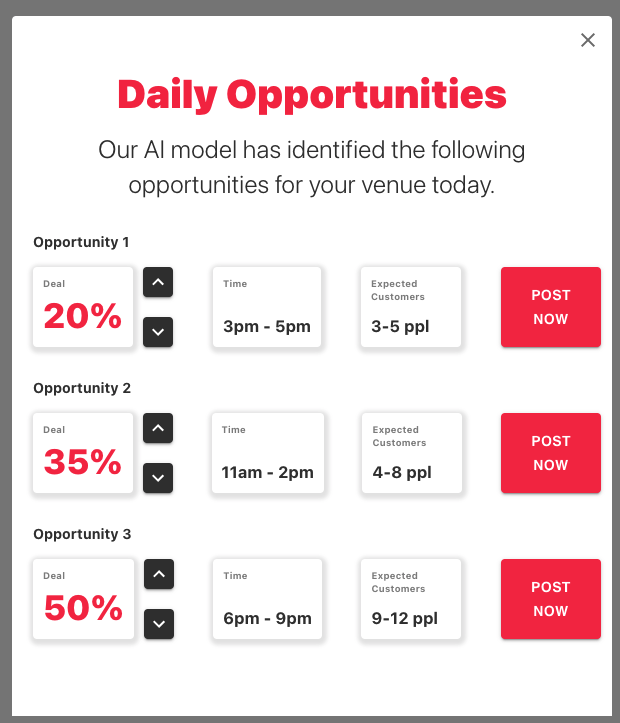

# EatClub Challenge

Created for EatClub's front-end challenge. Created entirely with React.
Data is retrieved from a GraphQL endpoint.

[Watch demo here](docs/demo.mp4)



## Getting Started

1. Update the values inside the `.env` file

```shell
REACT_APP_SERVER_URL=<server-url>
REACT_APP_API_ID=<api-id>
REACT_APP_API_KEY=<api-key>
```

2. Start the client

```shell
npm install
npm start
```
